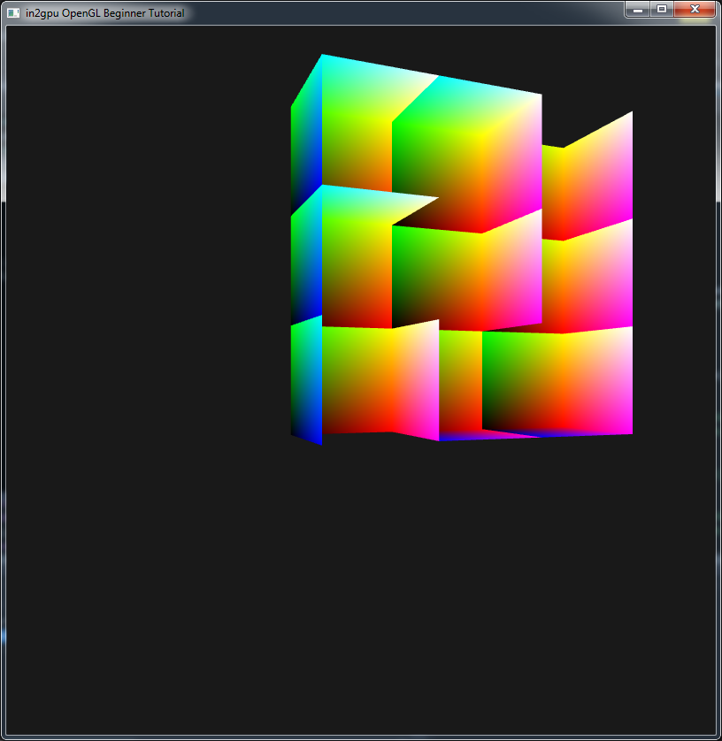
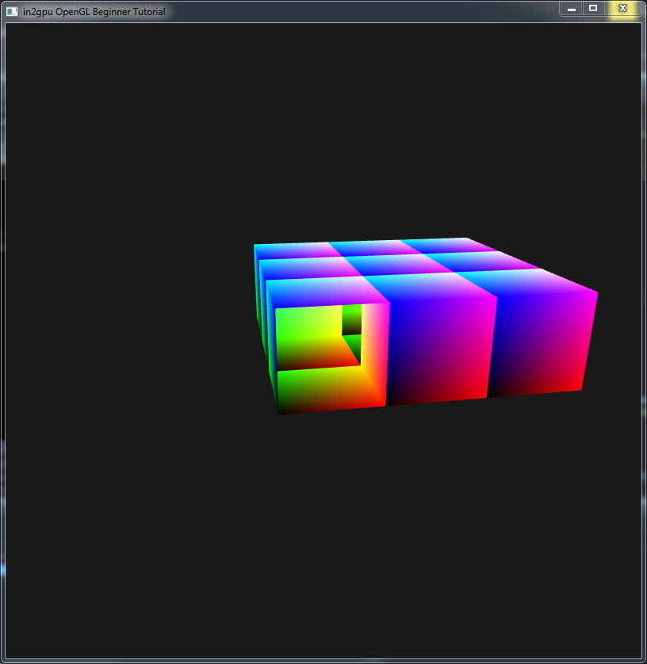
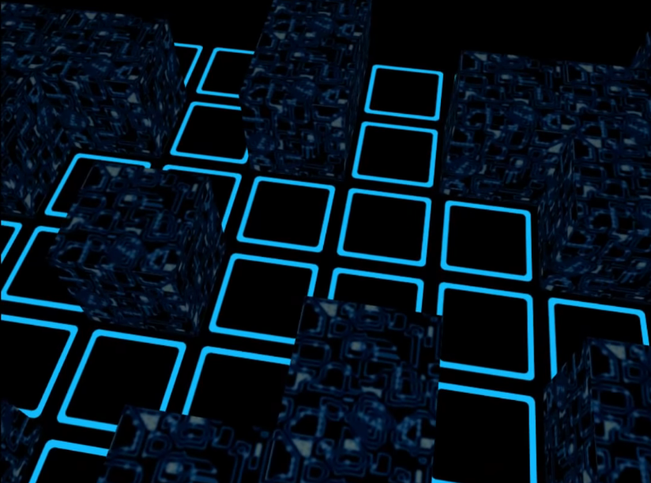

# README #
Copyright (C) 2016 Abhimanyu Nath <<abhimanyu4@gmail.com>>

### OpenGL 4 project created to experiment and learn about the fundamentals of computer graphics. Currently the project demonstrates the use of transparency, textures, user input, camera translations and rotations, lighting (diffuse and specular)

***

***

### Basic maze traversal with no bounding boxes

***

### You can find a demo of the maze traversal on the Youtube link given below

***
# DEMO VIDEO 

### You can watch the TRON-Legacy themed maze run demo from this [link][demo]. Be sure to switch to 1080p 60-FPS and turn on your speakers :)

[demo]: https://youtu.be/wPBrqv83Cro "OpenGL TRON maze demo"
